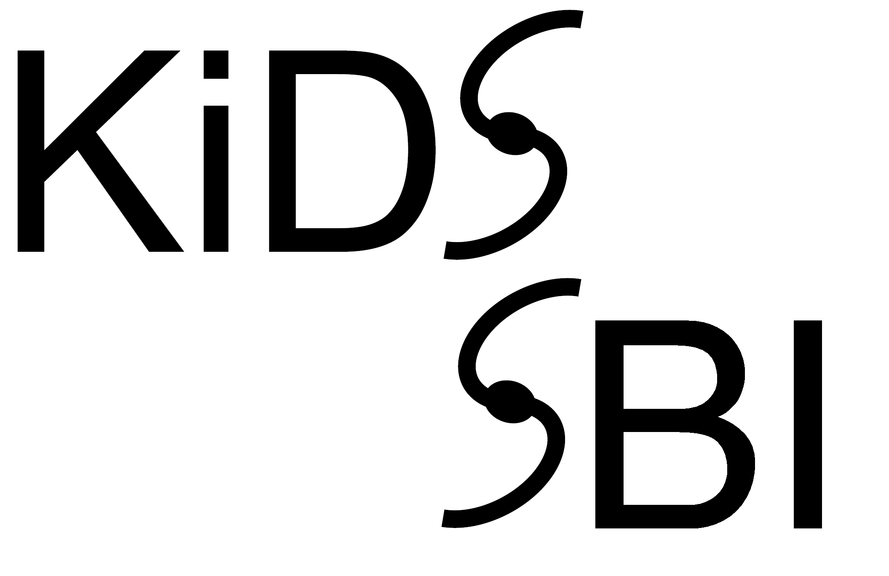

# Kilo-Degree Survey - Simulation-Based Inference

This repository supports running a likelihood-free analysis based on forward-simulatios of KiDS-1000 cosmic shear within the GLASS framework that was used in the following analyses:
- Likelihood-free inference: Lin et al. in prep.
- Forward simulations: von Wietersheim-Kramsta et al. in prep.

This repository contains the cosmology inference pipeline that was used in the KiDS-1000 analyses:
 - Methodology: [Joachimi, Lin, Asgari, Tröster, Heymans et al. 2021](https://arxiv.org/abs/2007.01844)
 - Cosmic shear: [Asgari, Lin, Joachimi et al. 2021](https://arxiv.org/abs/2007.15633)
 - 3x2pt: [Heymans, Tröster et al. 2021](https://arxiv.org/abs/2007.15632)
 - Beyond flat ΛCDM: [Tröster et al. 2021](https://arxiv.org/abs/2010.16416)

The repository is based on the master branch of KCAP module which can be found [here](https://github.com/KiDS-WL/kcap).

The pipeline is built on CosmoSIS, albeit a [modified version](https://bitbucket.org/tilmantroester/cosmosis/src/kcap/) that is `pip`-installable and doesn't rely on environmental variables.

The KCAP-GLASS repository integrates the Generator for Large Scale Structure environment (Tessore et al. in prep.), which can be found [here](https://github.com/glass-dev/glass), into CosmoSIS.

In addition, the KCAP-GLASS implements a new methodology to project 3D power spectra to 2D angular power spectra within the nonLimber module (Reischke et al. in prep.). This is achieved using the Levin method [Levin 1994](https://www.sciencedirect.com/science/article/pii/0377042794001189) and the code is available [here](https://github.com/rreischke/nonLimber_max).

A MontePython likelihood that wraps the kcap functionality can be found at [here](https://github.com/BStoelzner/KiDS-1000_MontePython_likelihood). 
Note that the standard version of MontePython does not support non-flat priors yet, which is a problem for samplers that distiguish between likelihood and prior (such as MultiNest and PolyChord). 
A version that supports Gaussian priors with MultiNest can be found [here](https://github.com/BStoelzner/montepython_public/tree/gaussian_prior).


## Installation

Clone the repository:
```
git clone git@github.com:mwiet/kcap_glass.git
cd kcap_glass
```

It's strongly recommended to use some kind of encapsulated environment to install `kcap_glass`, e.g., using `conda`. Here we assume that there is a anaconda installation available, that we need MPI support, and that we're on a machine with up-to-date GCC compilers. Notes on installations on macOS and details on how to set up things manually are [here](#installation-on-macos-and-other-details).

On machines with `module` support (e.g., splinter, cuillin), load the anaconda and openmpi modules first:
```
module load anaconda
module load openmpi
```
If there's no automated way to load these modules, make sure `conda` and MPI executables (`mpif90`) are on your `PATH`. For instructions on how to set up your own conda installation, see [Install conda](#install-conda). If you're using your own anaconda installation, don't load the module as well, as this just causes conflicts.

Now set up the conda environment using the provided `conda_env.yaml` file:
```
conda env create -f conda_env.yaml
```
This creates a `kcap_glass_env` environment that should have all the necessary dependencies. Activate the environment with `source activate kcap_glass_env`. NOTE: GLASS requires python >= 3.9

We need to install CAMB because we use the new python interface for it. If `kcap` is to be used on a local machine, `pip install camb` is all there is to do. On a heterogenous cluster like `splinter` or `cuillin`, we need to build CAMB ourselves, however. To do so, run
```
git clone --recursive git@github.com:cmbant/CAMB.git
cd CAMB
python setup.py build_cluster
python setup.py install
```

We also need to install GLASS:

```
git clone https://github.com/glass-dev/glass.git
# or clone via ssh: git clone git@github.com:glass-dev/glass.git
cd glass
pip install -e .
```
Cosmology dependency:
```
git clone https://github.com/glass-dev/cosmology.git
cd cosmology
pip install -e .
```
CosmoSIS-GLASS interface:
```
git clone https://github.com/mwiet/glass-cosmosis.git
cd glass-cosmosis
pip install -e .
```

Next, we have to install the nonLimber module:

```
git clone https://github.com/rreischke/nonLimber_max.git
cd nonLimber_max
pip install .
```

We can now build kcap (which installs a standalone version of CosmoSIS):
```
python build.py
```

To uninstall CosmoSIS (for example if you need to get the newest version), run `pip uninstall cosmosis_standalone`. To make a fresh installation of kcap, run `python build.py --clean`.

### Installation on macOS and other details

The default macOS compilers are supported now but `gfortran` still needs to be installed. This can be done with `homebrew` by running `brew install gcc`. Note that `gcc 9.2` seems to be incompatible with the `PolyChord` samplers included in cosmosis, so use a different version (e.g., 9.1).

If no MPI support is required, run `python build.py --no-mpi`.

### Install conda

Get [miniconda](https://conda.io/en/master/miniconda.html). For example on a Linux machine: 
```
wget https://repo.anaconda.com/miniconda/Miniconda3-latest-Linux-x86_64.sh
chmod +x Miniconda3-latest-Linux-x86_64.sh
./Miniconda3-latest-Linux-x86_64.sh
```

The installation will ask whether you want to add this conda installation to your `PATH` by adding some lines to your `.bashrc`. If you choose not to (for example because you don't want it to be the default installation), make sure the installation is accessible when building and running kcap.

## Usage

Make sure `conda` and MPI are accessible (e.g., by running `module load anaconda` and `module load openmpi`) and that `kcap_env` is activated (`source activate kcap_env`).
To test that everything is working, run the tests (todo...) and some of the configs in `runs/config`:
```
mkdir runs/output
cosmosis runs/config/KV450_no_sys.ini
```
For MPI:
```
mpirun -n 4 cosmosis --mpi runs/config/KV450_no_sys.ini
```

## Repository structure

N/A
